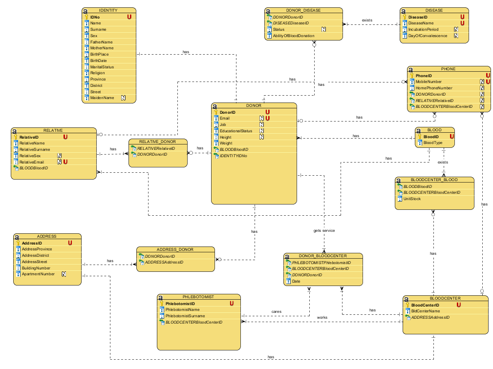

# Purpose of Project
- Blood is a substance used in the health sector and it is of vital importance that operation is performed quickly and smoothly. The goal of the project is to ensure that the data are kept accurate and accessible in the blood centers in order to reach the right and healthy blood in the fastest way.

## Logical Diagram of Database
